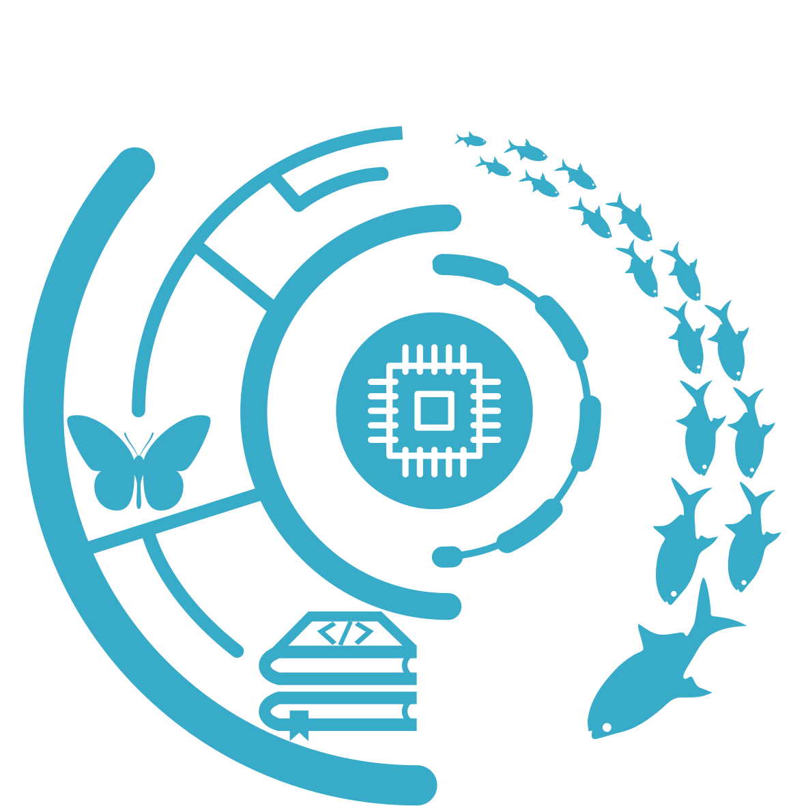
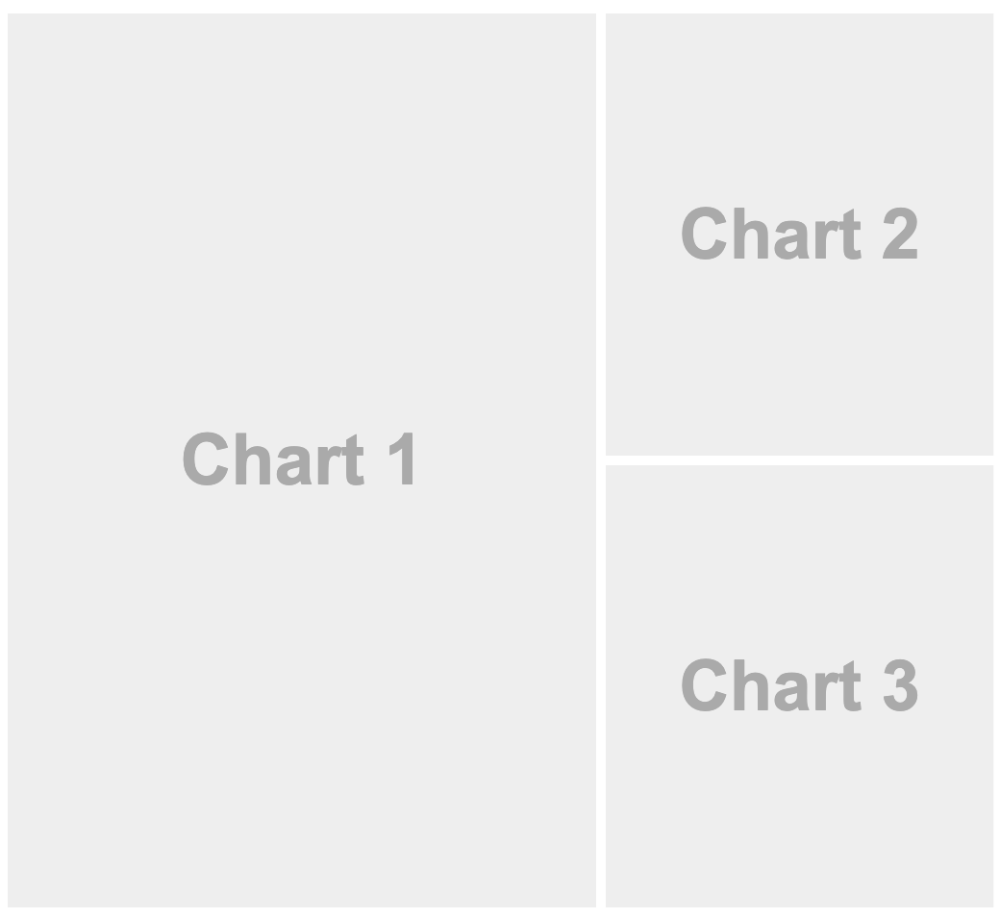

```{r setup, include = FALSE}
knitr::opts_chunk$set(
  comment = "#>",
  collapse = TRUE,
  warning = FALSE,
  message = FALSE,
  dev = "png",
  fig.width = 5,
  fig.height = 4.5,
  fig.align = 'center',
  width = 120
)
mypar <- list(fg = "#37abc8", bg = "transparent", las = 1)
par(mypar)
# library(icon)
rfa <- function(...) icon::fontawesome(...)
```


class: title-slide, middle


## .font200[`r icon::fontawesome("r-project")`asters]

<br><br>

.instructors[
  .font180[Interactive raster visualization with `r rfa("r-project")`]
  <br><br><br>
  .authors140[David Beauchesne & Kevin Cazelles]
  <br><br>
  `r format(Sys.time(), '%B %d, %Y')`
  <br>
  .font200[
  [`r rfa("github")`](https://github.com/inSilecoInc/interactiveRaster)
  [`r rfa("database")`](https://github.com/inSilecoInc/interactiveRaster/raw/gh-pages/data_and_script.zip)
  [`r rfa("file-pdf")`](https://github.com/inSilecoInc/interactiveRaster/raw/gh-pages/raster_p2.pdf)
  ]
]

<br>
</img>


.instructors[Content under [`r rfa("creative-commons")` `r rfa("creative-commons-by")`](https://creativecommons.org/licenses/by/4.0/) unless otherwise specified]


---

class: inverse, center, middle

# Learning objectives


## .font160[`r rfa("map")`  + `r rfa("r-project")`]


---

# Learning objectives

<br>

1. Understand the benefits of interactive data visualization with `r rfa("r-project")`

--

2. Learn how to produce and share interactive raster visualizations with `r rfa("r-project")`

--

3. Learn how to build interactive dashboards with `r rfa("r-project")`


---

class: inverse, center, middle

# `r rfa("info-circle")` Rationalize


## Why use `r rfa("r-project")` for interactive data visualization? (~10min)

---

# Interactive visualization

## Interactive data visualization

> Interactive data visualization refers to the use of modern data analysis software that enables users to directly manipulate and explore graphical representations of data.

--

## Why use interactive visualization?

  - Identify trends
  - Observe relationships in data
  - Data storytelling
  - Simplify complex data
  - Share and explore data
  - Get more out of static visualizations!

---

# Interactive visualization

## Javascript

> [JavaScript](https://www.javascript.com/) is a text-based programming language used both on the client-side and server-side that allows you to make web pages interactive.

--

> JavaScript is the modern interactive web

--

- Close to 1.5 million libraries

--

- Requires in depth knowledge of web-based programming, and, if you are a `r rfa("r-project")` user, learning another programming language

---

# Why `r rfa("r-project")`?

<br>

1. `r rfa("r-project")` packages are actively developped for interactive visualization. See the [htmlwidgets for R](https://www.htmlwidgets.org/) web page for examples

--

2. No need to learn a new language

--

3. Efficiently explore outputs from `r rfa("r-project")` analyses

--

4. Share interactive outputs of `r rfa("r-project")` analyses with collaborators in a variety of formats

--

5. For people still using [ArcGIS](www.arcgis.com) or [QGIS](www.qgis.org) solely for visual data exploration: interactive mapping in `r rfa("r-project")` can now - *partly* - address this

---

# Why `r rfa("r-project")`?

## HTML widgets

In `r rfa("r-project")`, HTML widgets are one of two things:

1. The [`htmlwidgets`](https://cran.r-project.org/package=htmlwidgets) package provides a framework for creating R bindings to JavaScript visualization libraries that can be rendered in a variety of formats (*e.g.* RStudio, R Markdown documents, Shiny applications, or standalone web pages).

--

2. A collection of R packages that allow a user to build interactive visualization (*i.e.* tables, charts, maps, networks, etc) through specific JavaScript libraries


---

# Why `r rfa("r-project")`?

## `r rfa("r-project")` packages for interactive mapping

### **Interactive visualization in general**

.pull-left[
- [`plotly`](https://cran.r-project.org/package=plotly) - uses [Plotly.js](https://plotly.com/javascript/)
- [`highcharter`](https://cran.r-project.org/package=highcharter) - uses [Highcharts.js](https://jkunst.com/highcharter/)
]

--

.pull-right[
*Work well with vectorized spatial objects (`sf` and `sp`) in particular. Not so much with rasters yet.*
]

--

### **Interactive mapping in particular**

.pull-left[
- [`leaflet`](https://cran.r-project.org/package=leaflet) `r rfa("check")` - uses [Leaflet.js](https://leafletjs.com/)
]

--

.pull-right[
*Works well with vectors (`sf` and `sp`) and rasters (`raster` and `stars`)*
]

--

### **`r rfa("r-project")` packages expanding `leaflet` capabilities**

  - [`mapview`](https://cran.r-project.org/package=mapview) `r rfa("check")`
  - [`tmap`](https://cran.r-project.org/package=tmap) `r rfa("check")`

---

class: inverse, center, middle

# Interactive raster mapping


## .font160[`r rfa("map")`  + `r rfa("r-project")`] (1h)

---

# <a href="https://leafletjs.com/"></a>

## JavaScript library

> Leaflet is the leading open-source JavaScript library for mobile-friendly interactive maps. Weighing just about 39 KB of JS, it has all the mapping features most developers ever need.

--

<h3>Examples<sup>*</sup></h3>

- [The New York Times](https://www.nytimes.com/projects/elections/2013/nyc-primary/mayor/map.html)
- [The Washington Post](https://www.washingtonpost.com/sf/local/2013/11/09/washington-a-world-apart/)
- [GitHub](https://github.blog/2013-06-13-there-s-a-map-for-that/)
- [Open Street Map](https://www.openstreetmap.org/#map=11/46.8543/-71.3414)


.font70[
<sup>*</sup>Examples provided in R Studio's [Leaflet for R](https://rstudio.github.io/leaflet/) introduction
]


---

# <a href="https://leafletjs.com/"></a>

## `r rfa("r-project")` package

[`leaflet`](https://cran.r-project.org/package=leaflet) .font90[06/2015 (1.0.0) &nbsp; // &nbsp; 01/2021 (2.0.4.1)]

- The `leaflet` package integrates and controls Leaflet maps through `r rfa("r-project")`

--

### **Features** - .font70[full list [here](https://rstudio.github.io/leaflet/)]

.font90[
- Interactive panning/zooming
- Compose maps using:
  - Map tiles
  - Markers
  - Polygons
  - Lines
  - Rasters
  - Popups
- Embed maps in knitr/R Markdown documents and Shiny apps
- Render spatial objects
]

---

# Package [`leaflet`](https://cran.r-project.org/package=leaflet)

## Quick map

.pull-left2[
Leaflet map centered on the St. Lawrence

```{r, eval = FALSE}
library(leaflet)
lf <- leaflet() %>%
 setView(lng = -63,
         lat = 48,
         zoom = 5)
 addTiles(group = 'Default')

lf
```

.font70[See [`setView()`](https://www.rdocumentation.org/packages/leaflet/versions/2.0.3/topics/setView) documentation for more options to set map extent.]


]

.pull-right2[
```{r load_leaflet, fig.width = 6, fig.height = 6, echo = FALSE}
library(leaflet)
lf <- leaflet() %>%
 addTiles(group = 'Default') %>%
 setView(lng = -63,
         lat = 48,
         zoom = 5)

lf
```
]


---

# Package [`leaflet`](https://cran.r-project.org/package=leaflet)

## A quick word on pipes

The pipe operator `%>%` is a chained method that lets you pass an intermediate result to the next function. Thus, these two code chunks provide the same output:

.pull-left[
```{r use_pipe}
# Example with pipe operator
lf <- leaflet() %>%
 setView(lng = -63,
         lat = 48,
         zoom = 5) %>%
 addTiles(group = 'Default')

```
]

.pull-right[
```{r nopipe}
# Example without pipe operator
lf <- setView(map = leaflet(),
              lng = -63,
              lat = 48,
              zoom = 5)
lf <- addTiles(map = lf,
               group = 'Default')
```
]


.font70[`%>%` is similar to the `+` operator used by `ggplot2` and `tmap`]

.font70[See [here](https://www.datacamp.com/community/tutorials/pipe-r-tutorial) for a full description of the history and use of pipes. Note that in the upcoming release

A [simple native pipe syntax](https://cran.r-project.org/doc/manuals/r-devel/NEWS.html), `|>`, will be included in the upcoming stable release.

]

---

# Package [`leaflet`](https://cran.r-project.org/package=leaflet)

## Base maps

.pull-left2[
`addTiles()` uses [OpenStreetMap](https://www.openstreetmap.org/) as default base map.

Use `addProviderTiles()` for other options.

```{r, eval = FALSE}
leaflet() %>%
 setView(lng = -63,
         lat = 48,
         zoom = 5) %>%
 addProviderTiles('Esri.OceanBasemap',
                  group = 'Ocean')
```

.font90[Full provider list [here](http://leaflet-extras.github.io/leaflet-providers/preview/index.html)]
]

.pull-right2[
```{r, fig.width = 6, fig.height = 6, echo = FALSE}
leaflet() %>%
      setView(lng = -63,
              lat = 48,
              zoom = 5) %>%
      addProviderTiles('Esri.OceanBasemap',
                       group = 'Ocean')
```
]

---

# Package [`leaflet`](https://cran.r-project.org/package=leaflet)

## Multiple base maps

.pull-left2[
Use [`addLayersControl()`](https://www.rdocumentation.org/packages/leaflet/versions/2.0.3/topics/addLayersControl) to toggle base map selection.

.font90[
```{r, eval = FALSE}
lf <-
 lf %>%
 addProviderTiles('Esri.OceanBasemap',
     group = 'Ocean') %>%
 addProviderTiles("OpenTopoMap",
     group = "Topo") %>%

 # Add layer selection
 addLayersControl(
     baseGroups = c('Default','Ocean',
                    'Topo'),
     position = 'topleft')

lf
```

Note that we are adding features to the preexisting `lf` object
]
]

.pull-right2[
```{r, fig.width = 6, fig.height = 6, echo = FALSE}
lf <- lf %>%
 addProviderTiles('Esri.OceanBasemap',
     group = 'Ocean') %>%
 addProviderTiles("OpenTopoMap",
     group = "Topo") %>%

 # Add layer selection
 addLayersControl(
     baseGroups = c('Default','Ocean','Topo'),
     position = 'topleft')

lf
```
]


---

# Package [`leaflet`](https://cran.r-project.org/package=leaflet)

## Add rasters

First, get some raster layers from the [`eDrivers`](https://github.com/eDrivers/eDrivers) `r rfa("r-project")` package, which provides data on environmental stressors for the St. Lawrence System.

Let's get data for hypoxia, demersal destructive fisheries (trawl and dredge), and acidification.

```{r, eval = TRUE}
# Install eDrivers
# devtools::install_github('eDrivers/eDrivers')

# Load data from eDrivers
library(eDrivers)
fetchDrivers(drivers = c('Hypoxia','FisheriesDD','Acidification'),
             output = 'data')

# Raster objects from eDrivers class objects
hyp <- raster('data/Hypoxia.tif')
fish <- raster('data/FisheriesDD.tif')
acid <- raster('data/Acidification.tif')
```

.font70[Use `fetchList()` to see all data available in `eDrivers`]

---

# Package [`leaflet`](https://cran.r-project.org/package=leaflet)

## Add rasters

.pull-left2[

Use [`addRasterImage()`](https://www.rdocumentation.org/packages/leaflet/versions/2.0.3/topics/addRasterImage) to add rasters from `raster` package.

```{r, eval = FALSE}
lf <- lf %>%
 addRasterImage(hyp,group = 'Hyp') %>%
 addRasterImage(fish,group = 'Fish') %>%
 addRasterImage(acid,group = 'Acid') %>%

# Reset layer selection
addLayersControl(
   baseGroups = c('Default','Ocean',
                  'Topo'),
   overlayGroups = c('Hyp','Fish',
                     'Acid'),
   position = 'topleft')

lf
```
]

.pull-right2[
```{r, fig.width = 6, fig.height = 6, echo = FALSE, eval = TRUE}
# Add layers to leaflet map
lf <- lf %>%
 addRasterImage(hyp,group = 'Hyp') %>%
 addRasterImage(fish,group = 'Fish') %>%
 addRasterImage(acid,group = 'Acid') %>%

# Reset layer selection
addLayersControl(
   baseGroups = c('Default','Ocean','Topo'),
   overlayGroups = c('Hyp','Fish','Acid'),
   position = 'topleft')

lf
```
]


---

# Package [`leaflet`](https://cran.r-project.org/package=leaflet)

## Add rasters

**A couple warnings:**

- `leaflet` uses the [EPSG:3857](https://spatialreference.org/ref/sr-org/7483/) projection and will convert the layers you add automatically. You may want to reproject your rasters manually to save computing time.

--

- Raster size is limited by default. Use argument `maxBytes` in `addRasterImage()` to change this.

---

# Package [`leaflet`](https://cran.r-project.org/package=leaflet)

```{r, echo = FALSE}
countdown::countdown(minutes = 15, seconds = 0)
```

<br/>

### `r rfa("star")` Select two raster layers to map and change their projection to EPSG:3857

- Use [https://epsg.io/](https://epsg.io/) to get the `proj` string

### `r rfa("star")` Generate a leaflet map with:

- Two tile providers (hint: visit [this](http://leaflet-extras.github.io/leaflet-providers/preview/index.html) website)

- The two newly projected raster layers

- Set view to the Bedford Institute of Oceanography
  - Get coordinates from [Google Maps](https://www.google.ca/maps) or [OpenStreetMap](https://www.openstreetmap.org/)

### `r rfa("star")` `r rfa("star")` Use a custom color palette to render the rasters

???
prj <- '+proj=merc +a=6378137 +b=6378137 +lat_ts=0.0 +lon_0=0.0 +x_0=0.0 +y_0=0 +k=1.0 +units=m +nadgrids=@null +wktext  +no_defs'
rasterObject <- projectRaster(rasterObject, crs = CRS(prj))
coords <- c(44.6828, -63.6118)

---

# Package [`mapview`](https://cran.r-project.org/package=mapview)

## `r rfa("r-project")` package

[`mapview`](https://cran.r-project.org/package=mapview) .font90[12/2015 (1.0.0) &nbsp; // &nbsp; 08/2020 (2.9.0)]

> `mapview` provides functions to very quickly and conveniently create interactive visualisations of spatial data. It’s main goal is to fill the gap of quick (not presentation grade) interactive plotting to examine and visually investigate both aspects of spatial data, the geometries and their attributes.


---

# Package [`mapview`](https://cran.r-project.org/package=mapview)

```{r, eval = TRUE, fig.width = 12, fig.height = 6}
library(mapview)
mv <- mapview(hyp) + fish + acid
mv
```


---

# Package [`mapview`](https://cran.r-project.org/package=mapview)

```{r, eval = TRUE, fig.width = 12, fig.height = 6}
mapshot(mv, url = 'data/map.html')
```

The interactive map can then be shared with the `html` file and `map_files/` folder


---

# Package [`mapview`](https://cran.r-project.org/package=mapview)

```{r, echo = FALSE}
countdown::countdown(minutes = 7, seconds = 0)
```

<br/>

### `r rfa("star")` Recreate the map you generated before with `leaflet` using `mapview`

### `r rfa("star")` `r rfa("star")` Export it as a `html` file

---

# Package [`tmap`](https://cran.r-project.org/package=tmap)

## `r rfa("r-project")` package

[`tmap`](https://cran.r-project.org/package=tmap) .font90[12/2015 (1.0.0) &nbsp; // &nbsp; 08/2020 (2.9.0)]

- `tmap` creates flexible thematic maps.

--

- We have looked at the static mapping visualization it offers

--

- Now we look at the interactive capabilities


---

# Package [`tmap`](https://cran.r-project.org/package=tmap)

.pull-left[
.font90[
```{r, fig.width = 5.5, fig.height = 5, echo = TRUE, eval = TRUE}
library(tmap)
tmap_mode("plot")
static <- tm_shape(fish) +
          tm_raster(title = "Fisheries")
static
```
]
]

.pull-right[
.font90[
```{r, fig.width = 5.5, fig.height = 5, echo = TRUE, eval = TRUE}
library(tmap)
tmap_mode("view")
inter <- tm_shape(fish) +
         tm_raster(title = "Fisheries")
inter
```
]
]

---

# Package [`tmap`](https://cran.r-project.org/package=tmap)

.pull-left[
.font90[
```{r, fig.width = 5.5, fig.height = 5, echo = TRUE, eval = FALSE}
library(tmap)
tmap_mode("plot")
static <- tm_shape(fish) +
          tm_raster(title = "Fisheries")
static

# Export as png
tmap_save(static,
          filename = "output/Fisheries.png")
```
]
]

.pull-right[
.font90[
```{r, fig.width = 5.5, fig.height = 5, echo = TRUE, eval = FALSE}
library(tmap)
tmap_mode("view")
inter <- tm_shape(fish) +
         tm_raster(title = "Fisheries")
inter

# Export as html
tmap_save(inter,
          filename = "output/Fisheries.html")
```
]
]

---

# Package [`tmap`](https://cran.r-project.org/package=tmap)

## Multiple layers

.pull-left2[
Use `tm_facets()` to include multiple raster layers

```{r, eval = FALSE}
rstack <- stack(hyp, fish, acid)
tmap_mode("view")
tm_shape(rstack) +
  tm_raster(title = c("Hypoxia",
              "Fisheries",
              "Acidification")) +
tm_facets(as.layers = TRUE,
  free.scales.raster = TRUE)

```
]


.pull-right2[
```{r, fig.width = 6, fig.height = 6, echo = FALSE, eval = TRUE}
rstack <- stack(hyp, fish, acid)
tmap_mode("view")
tm_shape(rstack) +
  tm_raster(title = c("Hypoxia",
              "Fisheries",
              "Acidification")) +
tm_facets(as.layers = TRUE,
  free.scales.raster = TRUE)
```
]

---

# Package [`tmap`](https://cran.r-project.org/package=tmap)

```{r, echo = FALSE, purl = FALSE}
countdown::countdown(minutes = 10, seconds = 0)
```

<br/>

### `r rfa("star")` Recreate the static map you generated before using `tmap` as an interactive map but first **resample** the raster to have a maximum of 20 cells per °.

### `r rfa("star")` `r rfa("star")` Export the interactive map as a `.html` files

---

# Solution !!!

```{r, eval = FALSE, include = FALSE, purl = FALSE}
# manipulation 
library(stars)
ras <- read_stars("data/bathy.tif")   
stl <- sf::st_read("data/st_laurence.geojson") 
ras2 <- st_warp(ras, cellsize = .05, crs = st_crs(ras))
ras_v <- ras2[stl]
names(ras_v) <- "Elevation"
# view mode
tmap_mode("view")
# colors 
pal <- colorRampPalette(c("#c7cbce", "#687677", "#222d3d", "#25364a", "#172434", "#ad6a11", "#e6a331", "#e4be29", "#f2ea8b"))
# raster 
elv <- tm_shape(ras_v) + 
  tm_raster("Elevation", breaks = seq(-800, 200, 100), palette = pal(11), midpoint = NA) + 
  tm_layout(main.title = "St-Lawrence river & Gulf", main.title.color = "#ad6a11") + 
  tm_xlab("longitude", size = 0.5) + tm_ylab("latitude", size = 0.5) +
  tm_graticules(lwd = .5, col = "#aaaaaa")
  
shp <- tm_shape(stl) + tm_borders(col = "black", lwd = 2)
oth <- tm_compass(type = "8star", position = c("left", "bottom")) +     
  tm_scale_bar(breaks = c(0, 100, 200), text.size = .8) + 
  tm_logo(c("https://www.r-project.org/logo/Rlogo.png"), position = c("right", "top"), height = 3) 
elv + shp + oth
```

---

class: inverse, center, middle

# Interactive data dashboards


## .font160[~30 min]


---

# Interactive data dashboards

- Data dashboards are information management tools used to visually display, track, analyze and share related data visualizations and that meet a particular objective. They can be viewed as interactive reports.

--

- Multiple types of dashboards, for example:
  - Operational dashboards
  - Strategic dashboards
  - Analytical dashboards

--

- Can be automatically updated as new data becomes available


---

# Interactive data dashboards in `r rfa("r-project")`

## `r rfa("r-project")` package

[`flexdashboard`](https://cran.r-project.org/package=flexdashboard) .font90[05/2016 (0.2.0) &nbsp; // &nbsp; 06/2020 (0.5.2)]

- Uses [R Markdown](https://rmarkdown.rstudio.com/) to create a grid dashboard that adapts the size of the dashboard components to the containing web page.

--

- Custom layouts based on rows and columns in a R Markdown document

--

- Can contain a wide variety of components:
  - htmlwidgets
  - base
  - lattice
  - grid
  - tabular data
  - text

---

# Interactive data dashboards in `r rfa("r-project")`

<iframe src="https://beta.rstudioconnect.com/jjallaire/htmlwidgets-highcharter/htmlwidgets-highcharter.html#sales-by-category" style="width:100%; height:55vh;"></iframe>


---

# A (very!) quick intro to R Markdown<sup>*</sup>

## R Markdown universe

R Markdown produces dynamic document in a variety of format.

### Opens new possibilities with R:

* make CV, poster ([`posterdown`](https://CRAN.R-project.org/package=posterdown)) & online presentation ([`xaringan`](https://CRAN.R-project.org/package=xaringan))
* format scientific paper ([`rticles`](https://CRAN.R-project.org/package=rticles))
* help to document your research through notebook ([`bookdown`](https://CRAN.R-project.org/package=bookdown))
* build an academic blog or website ([`blogdown`](https://CRAN.R-project.org/package=blogdown))

.font70[<sup>*</sup>See [R Markdown](https://rmarkdown.rstudio.com/) documentation for more details and [here](https://insileco.github.io/ResearchDown/) for a more complete presentation]

---

# A (very!) quick intro to R Markdown<sup>*</sup>

## But what's R Markdown?

- ["An authoring framework for data science."](https://rmarkdown.rstudio.com/lesson-1.html) (✔️)
- [A document format (.Rmd).](https://bookdown.org/yihui/rmarkdown/) (✔️)
- [An R package named rmarkdown.](https://rmarkdown.rstudio.com/docs/) (✔️)
- ["A tool for integrating text, code, and results."](https://r4ds.had.co.nz/communicate-intro.html) (✔️)
- ["A file format for making dynamic documents with R."](https://rmarkdown.rstudio.com/articles_intro.html) (✔️)
- ["A computational document."](http://radar.oreilly.com/2011/07/wolframs-computational-documen.html) (✔️)
- [Wizardry.](https://raw.githubusercontent.com/allisonhorst/stats-illustrations/master/rstats-artwork/rmarkdown_wizards.png) (🧙)


.font70[<sup>*</sup>See [R Markdown](https://rmarkdown.rstudio.com/) documentation for more details and [here](https://insileco.github.io/ResearchDown/) for a more complete presentation]

---

# A (very!) quick intro to R Markdown<sup>*</sup>

## How does R Markdown work?

.pull-left[
```{r echo=FALSE, out.width="100%"}
knitr::include_graphics("img/Rmdformat.png")
```
]

.pull-right[
- 🤷
- I press knit, a document appears, and I believe that anything happening in between could be actual magic.
- `knitr` executes the code and converts `.Rmd` to `.md`; Pandoc renders the `.md` file to the output format you want.
]

.font70[<sup>*</sup>See [R Markdown](https://rmarkdown.rstudio.com/) documentation for more details and [here](https://insileco.github.io/ResearchDown/) for a more complete presentation]

---

# Package [`flexdashboard`](https://cran.r-project.org/package=flexdashboard)

```{r, echo = FALSE}
countdown::countdown(minutes = 2, seconds = 0)
```

```{r, eval = FALSE}
library(rmarkdown)
library(flexdashboard)
draft("dashboard.Rmd",
      template = "flex_dashboard",
      package = "flexdashboard")
```

Creates a `.Rmd` document with a dashboard layout

---

# Package [`flexdashboard`](https://cran.r-project.org/package=flexdashboard)

.pull-left[
.font70[
````md
---
title: "Untitled"
output:
  flexdashboard::flex_dashboard:
    orientation: columns
    vertical_layout: fill
---


Column {data-width=650}
------------------------------

### Chart A

`r ''`
```r
```

Column {data-width=350}
------------------------------

### Chart B

`r ''`
```r
```

### Chart C

`r ''`
```r
```
````
]
]

---

# Package [`flexdashboard`](https://cran.r-project.org/package=flexdashboard)

.pull-left[
.font70[
````md
---
title: "Untitled"
output:
  flexdashboard::flex_dashboard:
    orientation: columns
    vertical_layout: fill
---


Column {data-width=650}
------------------------------

### Chart A

`r ''`
```r
```

Column {data-width=350}
------------------------------

### Chart B

`r ''`
```r
```

### Chart C

`r ''`
```r
```
````
]
]

.pull-right[
.font80[
**Columns** of width X: level 2 markdown header

```md
Column {data-width=X}
---------------------

or

## Column {data-width=X}
```

**Rows**: level 3 markdown header

```md
### Chart name
```

**Charts**: r code chunk

````md
`r ''`
```r
# Viz here
```
````
]
]

---

# Package [`flexdashboard`](https://cran.r-project.org/package=flexdashboard)

.pull-left[
.font70[
````md
---
title: "Untitled"
output:
  flexdashboard::flex_dashboard:
    orientation: columns
    vertical_layout: fill
---


Column {data-width=650}
------------------------------

### Chart A

`r ''`
```r
```

Column {data-width=350}
------------------------------

### Chart B

`r ''`
```r
```

### Chart C

`r ''`
```r
```
````
]
]

.pull-right[
<br/>

]

---

# Package [`flexdashboard`](https://cran.r-project.org/package=flexdashboard)

```{r, echo = FALSE}
countdown::countdown(minutes = 2, seconds = 0)
```

Use `rmarkdown::render()` to render `.html` dashboard and visualize the still empty dashboard by opening `dashboard.html` in your web browser.

```r
rmarkdown::render('dashboard.Rmd')
```

---

# Package [`flexdashboard`](https://cran.r-project.org/package=flexdashboard)

```{r, echo = FALSE}
countdown::countdown(minutes = 2, seconds = 0)
```

We will now populate the dashboard with some visual components.

Chart 1: `tmap` interactive map including hypoxia and acidification

````md
### Chart A

```r
tmap_mode('view')
tm_shape(rstack) +
  tm_raster(title = c("Hypoxia",
                      "Acidification")) +
tm_facets(as.layers = TRUE,
  free.scales.raster = TRUE)
```
````

---

# Package [`flexdashboard`](https://cran.r-project.org/package=flexdashboard)

```{r, echo = FALSE}
countdown::countdown(minutes = 2, seconds = 0)
```

We will now populate the dashboard with some visual components.

Chart 2: Overlaid histograms of values for hypoxia and acidification using `plotly`

````md
### Chart B

```r
plot_ly(alpha = 0.6, nbinsx = 30) %>%
  add_histogram(x = values(hyp), name = 'Hypoxia') %>%
  add_histogram(x = values(acid), name = 'Acidification') %>%
  layout(barmode = "overlay")
```
````

---

# Package [`flexdashboard`](https://cran.r-project.org/package=flexdashboard)

```{r, echo = FALSE}
countdown::countdown(minutes = 2, seconds = 0)
```

We will now populate the dashboard with some visual components.

Chart 3: `tmap` interactive map of the sum of hypoxia and acidification

````md
### Chart C

```r
s <- sum(rstack, na.rm = TRUE)
s[is.na(values(acid))] <- NA
tm_shape(s) +
 tm_raster(title = "Cumulative exposure")
```
````

---

# Package [`flexdashboard`](https://cran.r-project.org/package=flexdashboard)

```{r, echo = FALSE}
countdown::countdown(minutes = 2, seconds = 0)
```

Render the now populated dashboard and visualize it by opening `dashboard.html` in your web browser.

```r
rmarkdown::render('dashboard.Rmd')
```


---

# Package [`flexdashboard`](https://cran.r-project.org/package=flexdashboard)

```{r, echo = FALSE}
countdown::countdown(minutes = 15, seconds = 0)
```

<br/>


### `r rfa("star")` Create a `flexdashboard` layout with 2 columns and 2 rows

--

### `r rfa("star")` `r rfa("star")` Include 4 charts of your choice. Include at least:

  - 1 interactive map using `leaflet()`
  - 1 interactive map using `tmap()`

--

### `r rfa("star")` `r rfa("star")` `r rfa("star")` Render the dashboard as `.html` document

---

class: inverse, center, middle

# Shiny applications


## .font160[~30 min]

---

# Shiny applications

- Interactive capabilities thus far limited to base maps, panning, zooming and clicking.

--

- Underlying code remains static with a fixed user interfaces.

--

- Capabilities are limited in terms of user input for controlling interactive content.

--

- In comes Shiny!


---

# Shiny applications

## `r rfa("r-project")` package

[`shiny`](https://cran.r-project.org/package=shiny) .font90[12/2012 (0.2.3) &nbsp; // &nbsp; 06/2020 (1.5.0)]


> [`shiny`](https://cran.r-project.org/package=shiny) makes it incredibly easy to build interactive web applications with R. Automatic "reactive" binding between inputs and outputs and extensive prebuilt widgets make it possible to build beautiful, responsive, and powerful applications with minimal effort.


---

# [`shiny`](https://CRAN.R-project.org/package=shiny)

## Pros

- The package makes it possible to use R's data analysis and visualization capabilities in an app. Although we focuse on mapping rasters, `shiny` allows for much more extensive capabilities.

--

- Applications can be run locally, deployed on R Studio's [Shiny Server](https://rstudio.com/products/shiny/shiny-server/), or to a hosting service such as [shinyapps.io](https://shinyapps.io)

--

- Extensive documentation and material is available for shiny applications.

--

- See R Studio's [Shiny apps library](https://shiny.rstudio.com/gallery/) for many examples

---

# [`shiny`](https://CRAN.R-project.org/package=shiny)

## Cons

- Syntax and logic of a Shiny application is a little bit different than what we are usually used to with R

--

- Harder to troubleshoot and know exactly what is going on under the hood

--

- Because it is more complex, it is worthwhile to really ponder whether a shiny application is necessary for what we wish to accomplish


---

# [`shiny`](https://CRAN.R-project.org/package=shiny)

.font80[
```{r, eval = FALSE}
# General environment / data preparation
library(shiny)
library(leaflet)
library(raster)
Hypoxia <- raster('data/Hypoxia.tif')
Acidification <- raster('data/Acidification.tif')
Fisheries <- raster('data/FisheriesDD.tif')
rstack <- stack(Hypoxia, Acidification, Fisheries)

# User interface
ui <- fluidPage(
 radioButtons(inputId = 'raster', label = 'Rasters to select',
   choices = c("Hypoxia" = "Hypoxia", "Fisheries" = "FisheriesDD",
               "Acidification" = "Acidification")),
 leafletOutput(outputId = "map", height = 800)
)

# Server function
server <- function(input, output) {
 output$map <- renderLeaflet({
  leaflet() %>%
  addProviderTiles("CartoDB.Positron") %>%
  addRasterImage(rstack[[input$raster]])
 })
}

# Shiny app function
shinyApp(ui, server)
```
]

---

# [`shiny`](https://CRAN.R-project.org/package=shiny)

## Structure

- User interface object (`ui`):
  - Controls layout and appearance of the app
  - Front end of the app
  - What the user sees and interacts with

--

- Server function (`server`):
  - Instructions sent to the computer/server running R to build the app
  - Back end of the application

--

- A call to the shinyApp function (`shinyApp(ui, server)`)

---

# [`shiny`](https://CRAN.R-project.org/package=shiny)

## General environment

```{r, eval = TRUE}
# General environment / data preparation
library(shiny)
library(leaflet)
library(raster)
Hypoxia <- raster('data/Hypoxia.tif')
Acidification <- raster('data/Acidification.tif')
Fisheries <- raster('data/FisheriesDD.tif')
rstack <- stack(Hypoxia, Acidification, Fisheries)
```

- The general environment - *i.e.* before the `ui` object and `server` function can be used to load libraries, data, functions, or any other components that can be used by your app and be loaded only once.


---

# [`shiny`](https://CRAN.R-project.org/package=shiny)

## [Control widget](https://shiny.rstudio.com/gallery/widget-gallery.html)

```{r, eval = FALSE}
radioButtons(inputId = 'raster', label = 'Rasters to select',
  choices = c("Hypoxia" = "Hypoxia", "Fisheries" = "FisheriesDD",
              "Acidification" = "Acidification")),
```

- In the `ui` object, used to provide choices to a user to interact with the app

--

- Creates a vector object called `input$inputId` with the elements chosen by the user that can be used by the server to update displayed elements. For example, if the user selects `'Hypoxia'`, then this value will be accessible through `input$raster` on the server side of the application.

```{r, eval = FALSE}
# This code cannot actually be checked, do not try to run
input$raster
> "Hypoxia"
```


---

# [`shiny`](https://CRAN.R-project.org/package=shiny)

## [Control widget](https://shiny.rstudio.com/gallery/widget-gallery.html)


<iframe src="https://shiny.rstudio.com/gallery/widget-gallery.html" style="width:100%; height:55vh;"></iframe>


---

# [`shiny`](https://CRAN.R-project.org/package=shiny)

## [Reactive output](https://shiny.rstudio.com/tutorial/written-tutorial/lesson4/)

```{r, eval = FALSE}
leafletOutput(outputId = "map", height = 800)
```

- Displayed elements that automatically respond when a user plays with a control widget.

- In the `ui` object, tells Shiny where to position the element to display


---

# [`shiny`](https://CRAN.R-project.org/package=shiny)

## [Reactive output](https://shiny.rstudio.com/tutorial/written-tutorial/lesson4/)

.font90[
| Output function (`ui`) | Creates |
| :-------------- | :------ |
| `dataTableOutput()` |	DataTable |
| `htmlOutput()` |	raw HTML |
| `imageOutput()` |	image |
| `plotOutput()` |	plot |
| `tableOutput()` |	table |
| `textOutput()` |	text |
| `uiOutput()` |	raw HTML |
| `verbatimTextOutput()` |	text |
| `leafletOutput()` | leaflet map |
]

---

# [`shiny`](https://CRAN.R-project.org/package=shiny)

## [Reactive output](https://shiny.rstudio.com/tutorial/written-tutorial/lesson4/)

```{r, eval = FALSE}
output$map <- renderLeaflet({
 leaflet() %>%
 addProviderTiles("CartoDB.Positron") %>%
 addRasterImage(rstack[[input$raster]])
})
```

- Displayed elements that automatically respond when a user plays with a control widget.

- In the `server` function, tells Shiny how to build the object

---

# [`shiny`](https://CRAN.R-project.org/package=shiny)

## [Reactive output](https://shiny.rstudio.com/tutorial/written-tutorial/lesson4/)

.font90[
| Output function (`ui`) | Render function (`server`) | Creates |
| :--------------------- | :------------------------- | :------ |
| `dataTableOutput` |	`renderDataTable()` | DataTable |
| `htmlOutput` | `renderImage()` | raw HTML |
| `imageOutput` |	`renderImage()` | image |
| `plotOutput` |	`renderPlot()` | plot |
| `tableOutput` |	`renderTable()` | table |
| `textOutput` |	`renderText()` | text |
| `uiOutput` | `renderUI()` | raw HTML |
| `verbatimTextOutput` | `renderVerbatimText()` |	text |
| `leafletOutput()` | `renderLeaflet()` | leaflet map |
]


---

# [`shiny`](https://CRAN.R-project.org/package=shiny) & [`flexdashboard`](https://CRAN.R-project.org/package=flexdashboard)

- Using `shiny` with `flexdashboard` can allow you to take advantage of the easy layout options provided by `flexdashboard` to structure your interactive dashboard with capabilities provided by `shiny`

--

- Note that, if you want to, all the necessary functions for custom layouts are available directly using Shiny

--

- Start by generating the same draft dashboard as before

```{r, eval = FALSE}
library(rmarkdown)
library(flexdashboard)
draft("shiny_dashboard.Rmd",
      template = "flex_dashboard",
      package = "flexdashboard")
```

---

# [`shiny`](https://CRAN.R-project.org/package=shiny) & [`flexdashboard`](https://CRAN.R-project.org/package=flexdashboard)

- Add `runtime: shiny` to the YAML metadata

```md
---
title: "Untitled"
output:
  flexdashboard::flex_dashboard:
    orientation: columns
    vertical_layout: fill
runtime: shiny
---
```

---

# [`shiny`](https://CRAN.R-project.org/package=shiny) & [`flexdashboard`](https://CRAN.R-project.org/package=flexdashboard)

- In the `setup` code chunk, you can include calls to libraries and objects

````md
`r ''`
```r setup
# General environment / data preparation
library(shiny)
library(leaflet)
library(raster)
Hypoxia <- raster('data/Hypoxia.tif')
Acidification <- raster('data/Acidification.tif')
Fisheries <- raster('data/FisheriesDD.tif')
rstack <- stack(Hypoxia, Acidification, Fisheries)
```
````

---

# [`shiny`](https://CRAN.R-project.org/package=shiny) & [`flexdashboard`](https://CRAN.R-project.org/package=flexdashboard)

Use `## Column {.sidebar}` to include a sidebar in which to embed the control widgets you wish to use

````md
## Column {.sidebar}

`r ''`
```r
radioButtons(inputId = 'raster', label = 'Rasters to select',
  choices = c("Hypoxia" = "Hypoxia", "Fisheries" = "FisheriesDD",
              "Acidification" = "Acidification"))
```
````

---

# [`shiny`](https://CRAN.R-project.org/package=shiny) & [`flexdashboard`](https://CRAN.R-project.org/package=flexdashboard)

- Populate the layout with the reactive outputs you wish to display


````md
### Chart A

`r ''`
```r
leafletOutput(outputId = "map")

output$map <- renderLeaflet({
 leaflet() %>%
 addProviderTiles("CartoDB.Positron") %>%
 addRasterImage(rstack[[input$raster]])
})

```
````

---

# [`shiny`](https://CRAN.R-project.org/package=shiny) & [`flexdashboard`](https://CRAN.R-project.org/package=flexdashboard)

```{r, echo = FALSE}
countdown::countdown(minutes = 5, seconds = 0)
```

- Finally, run the `shiny` app with `flexdashboard` with `rmarkdown::run()`

```{r, eval = FALSE}
rmarkdown::run('shiny_dashboard.Rmd')
```

---

# [`shiny`](https://CRAN.R-project.org/package=shiny)

## [Reactive expressions](https://shiny.rstudio.com/tutorial/written-tutorial/lesson6/)

- A reactive expression is an R expression that uses widget input and returns a value

- For example, if you want to perform a raster calculation to combine raster stacks as a function of user input

```{r, eval = FALSE}
rasterFunction <- reactive({
  sum(rstack[[input$raster]], na.rm = T) %>%
  calc(function(x) ifelse(x == 0, NA, x))
})

```

---

# [`shiny`](https://CRAN.R-project.org/package=shiny)

## [Observe expression](https://shiny.rstudio.com/reference/shiny/latest/observe.html)

- An observer is like a reactive expression in that it can read reactive values and call reactive expressions, and will automatically re-execute when those dependencies change

- For example, we may want to update a raster when a user selects different options

```{r, eval = FALSE}
observe({
  # Clear maps if no raster is selected
  leafletProxy(mapId = "map2") %>%
  clearImages() %>% # Clears previous raster
  addRasterImage(x = rasterFunction())
})
```

---

# [`shiny`](https://CRAN.R-project.org/package=shiny) & [`flexdashboard`](https://CRAN.R-project.org/package=flexdashboard)

```{r, echo = FALSE}
countdown::countdown(minutes = 20, seconds = 0)
```

Starting from the `shiny` app we just created using `flexdashboard`:

### `r rfa("star")` Modify the global environment elements by :

- Normalize `FisheriesDD` values (hint: `maxValue()`)
- Change raster projection to EPSG:3857
- Create a raster stack with rasters

--

### `r rfa("star")` `r rfa("star")` Add a checkbox input widget with the 3 rasters to the sidebar

--

### `r rfa("star")` `r rfa("star")` Add a leaflet map in place of Chart B

--

### `r rfa("star")` `r rfa("star")` `r rfa("star")` Add a `reactive()` function that sums raster as a function of layers selected by the user in the checkbox input widget

--

### `r rfa("star")` `r rfa("star")` `r rfa("star")` Add an `observe()` function that updates the new leaflet map with the reactive object


---


class: inverse, center, middle

# Recap


---

# Recap

*Tip of the iceberg*

See documentation and resources available for each package for much more options to customize your interactive visualizations:

- [`leaflet`](https://rstudio.github.io/leaflet/)
- [`mapview`](https://r-spatial.github.io/mapview/)
- [`tmap`](https://github.com/mtennekes/tmap)
- [`flexdashboard`](https://rmarkdown.rstudio.com/flexdashboard/index.html)
- [`shiny`](https://shiny.rstudio.com/)

--

Also, keep in mind that although `r rfa("r-project")` packages provide bindings to other languages to make our lives easier, you can also code in the native language:

- [HTML](www.w3schools.com/html): web page
- [CSS](www.w3schools.com/css): style
- [JavaScript](www.w3schools.com/js): interactive content


---

# Recap

## An example:

[eDrivers](https://david-beauchesne.shinyapps.io/edriversapp/) `shiny` app 
